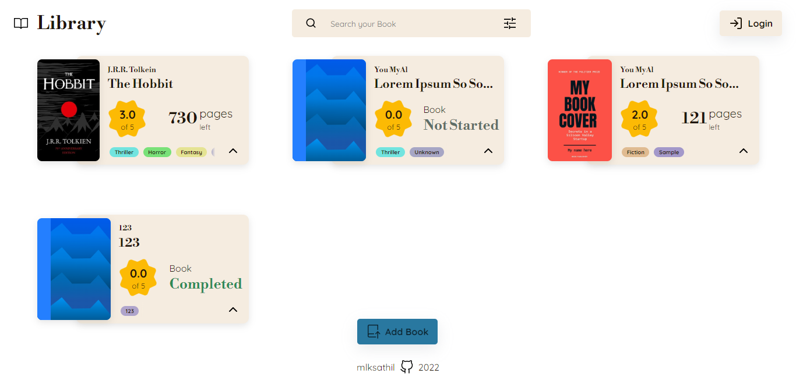
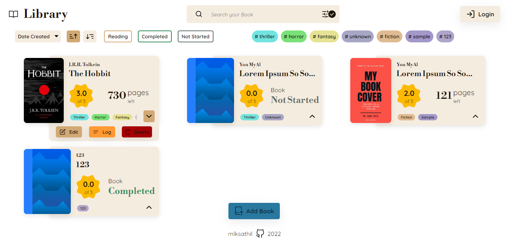
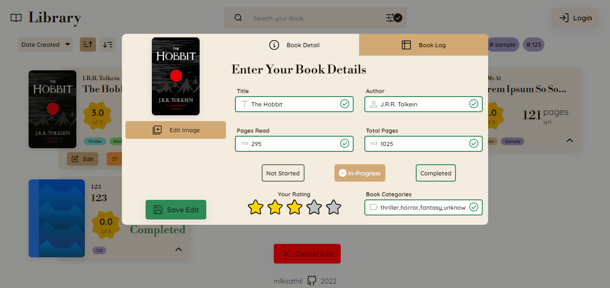

# Library

A Digital Library Markup - Library Markup Made with HTML, CSS, JS

## Screenshots

## Features

- [x] Add New Books
- [x] Delete Books
- [x] Edit Existing Books
    - [x] Create Book Logs
- [x] Filter & Sorting
    - Filter by:
        - [x] Search
        - [x] Tags
    - Sort by Types in DropDown
- [x] Local Storage 
- [ ] Login with Firebase

## Learn

[Learnt over the process](./miss'n'take.md)

## Attribution

- Icons from:
    - Octicons
    - Feather Icons
    - Google Fonts

- Favicon: 
    - [Cropped from Image](https://www.vecteezy.com/vector-art/4629763-library-logo-icon-set)

- Fonts from:
    - Google Fonts: Libre Bodoni + Quicksand

- Star Rating System implemented with help from :
    - [codemyui (codepen.io)](https://codepen.io/ashleynolan/pen/MyqrPr?editors=0100)